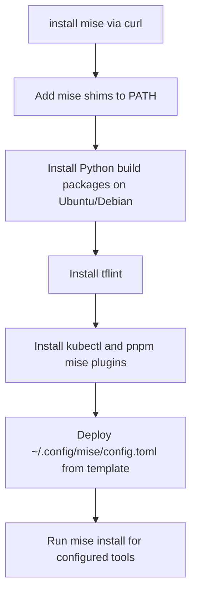
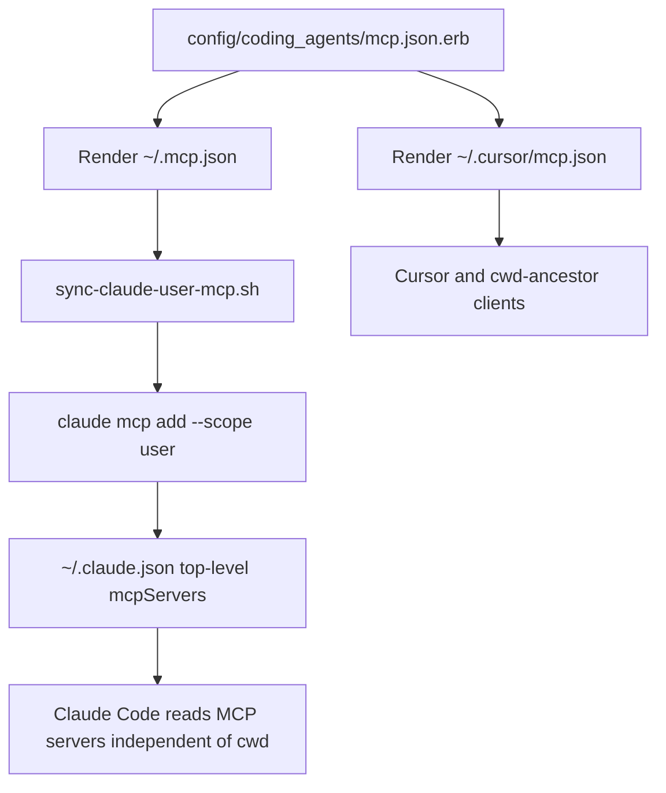

# dotfiles
> Accio, My Utensils!

## Usage
### Clone this repository
```shell
git clone --recursive https://github.com/Tyaba/dotfiles.git
```

## Prerequisites
```shell
sudo apt update
sudo apt install -y curl lsb-release
```
### wslの場合
windowsのPATHが入っているとinstall済と誤判定するので直す
sudo emacs /etc/wsl.conf
```
# WindowsのPATHを引き継がない設定を追記する
[interop]
appendWindowsPath = false
```

### Dry-run
```shell
./install.sh -n
```

### Apply
```shell
./install.sh
```

### Add new cookbook
```shell
mkdir cookbooks/:app_name
$EDITOR cookbooks/:app_name/default.rb
$EDITOR roles/$(uname)/default.rb
```

### Dev Container (lightweight role)

`roles/devcontainer/` is a lightweight role intended for Dev Containers (e.g. the `@devcontainers/cli` workflow in [tyaba-env](https://github.com/Tyaba/tyaba-env)). It assumes:

- devcontainer features already installed `git` / `gh` / `gcloud` / `mise` / `claude`
- project `.mise.toml` installs language runtimes (`python` / `uv` / `node` / `pnpm`)

It deploys only user-level dotfiles (`.claude/`, `.codex/`, `.cursor/`, `.mcp.json`, `.gitconfig`, zsh config) and the Codex CLI (needed by the `codex` MCP server in `~/.mcp.json`). Heavy cookbooks (emacs / docker / ghostty / redis / brew / GUI apps) and macOS-only setup are skipped.

Run without sudo:

```shell
DOTFILES_ROLE=devcontainer ./install.sh
```

`install.sh` detects the env var and runs mitamae as the workspace user (no `sudo -E`), since this role only touches `$HOME`. `lib/recipe.rb` then routes to `roles/devcontainer/default.rb` instead of the platform default.

### mise managed tools

`cookbooks/mise/default.rb` installs mise via the official curl installer, deploys `config/mise/config.toml.erb` to `~/.config/mise/config.toml`, and runs `mise install` from that config.



## Coding Agents

### Configuration Structure

```
config/
└── coding_agents/
    ├── claude/             # Claude Code-specific (settings.json, CLAUDE.md, etc.)
    ├── codex/              # Codex CLI-specific (AGENTS.md)
    ├── cursor/             # Cursor-specific (rules/, hooks.json)
    ├── hooks/              # Shared hooks
    ├── skills/             # Shared skills
    ├── mcp.json.erb        # MCP server definitions (ERB template)
    ├── sync-claude-user-mcp.sh
    └── user-rules.md       # Shared user rules (Claude Code / Cursor)
```

### Deployment

`roles/base/default.rb` deploys configurations via symlinks:

| Source | Target |
|---|---|
| `config/coding_agents/claude/settings.json` | `~/.claude/settings.json` |
| `config/coding_agents/skills/` | `~/.claude/skills/`, `~/.cursor/skills/` |
| `config/coding_agents/mcp.json.erb` | `~/.mcp.json`, `~/.cursor/mcp.json` |
| `config/coding_agents/codex/AGENTS.md` | `~/.codex/AGENTS.md` |

After rendering `~/.mcp.json`, `roles/base/default.rb` runs
`config/coding_agents/sync-claude-user-mcp.sh`. The script reads the rendered MCP
definitions and registers them with `claude mcp add --scope user`, so Claude Code
also sees them in devcontainers where `/workspaces/<name>` is outside `$HOME`.



### Codex Offload (via MCP server)

Claude Code tasks are automatically offloaded to Codex via the `codex mcp-server` MCP integration. Claude calls `mcp__codex__codex` as a regular tool, enabling natural auto-delegation. Delegation criteria are defined in `config/coding_agents/user-rules.md`.

**Setup (after `./install.sh`):**
```shell
codex login          # Authenticate with ChatGPT Enterprise (one-time)
```

**Key features:**
- `base-instructions` parameter allows dynamic injection of project-specific rules into Codex
- `codex-reply` enables multi-turn Codex sessions via `threadId`
- `~/.codex/AGENTS.md` provides static global rules for direct Codex CLI usage

**Constraints:**
- Requires local OAuth authentication (browser flow) -- not available in CI/headless environments

### Slack MCP OAuth in devcontainers

The `slack` entry in `config/coding_agents/mcp.json.erb` is an HTTP-transport MCP
server backed by Slack's hosted endpoint (`https://mcp.slack.com/mcp`) and
authenticated via OAuth 2.0 (PKCE) with `callbackPort: 3118`. Claude Code
performs the OAuth flow on first use and persists the resulting tokens
client-side -- they are **not** part of `~/.mcp.json` or the rendered
`mcpServers` config.

Because Claude Code state inside a devcontainer lives in a separate named
volume (`claude-code-config-${devcontainerId}`) from the host, the tokens
obtained on the host are **not** visible to Claude Code running inside the
container. As a result, `claude mcp list` inside the container will show:

```
slack  ✗ Failed to connect
```

until the OAuth flow is completed once from inside the container.

#### Recommended workflow

1. Start the devcontainer and run `claude` once.
2. When `slack` is reported as unauthenticated, trigger the OAuth flow from
   the Claude Code UI (e.g. `/login slack` or by invoking any `mcp__slack__*`
   tool). Claude Code will open a browser on the host that posts the
   authorization code back to `http://localhost:3118/...`.
3. For the callback to reach the container, ensure
   `forwardPorts: [3118]` is set in the project's `.devcontainer/devcontainer.json`.
   This is configured at the [tyaba-env](https://github.com/Tyaba/tyaba-env)
   template level, not here.
4. Subsequent container starts reuse the saved tokens as long as the
   `claude-code-config-*` named volume is preserved.

#### Why not bind-mount the host tokens?

Claude Code stores OAuth credentials in user-scoped state (under `~/.claude/`
and `~/.claude.json`-adjacent locations) that also contains many other
secrets unrelated to Slack. Bind-mounting these into the container would
broaden the secret surface for every running container and is therefore not
done by this dotfiles repo. A per-server token export/import workflow would
be cleaner but is not currently provided by Claude Code; for now, a one-time
in-container OAuth flow is the recommended path.
