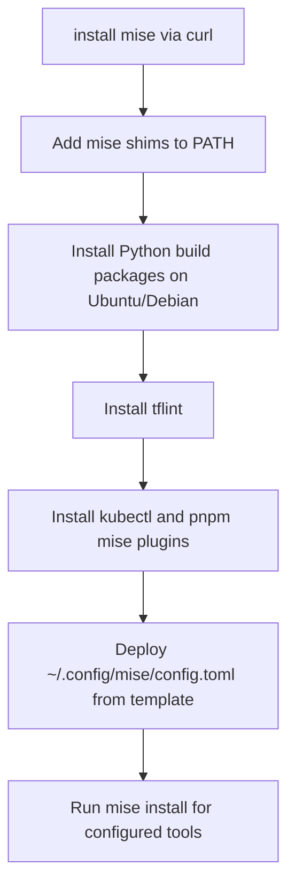
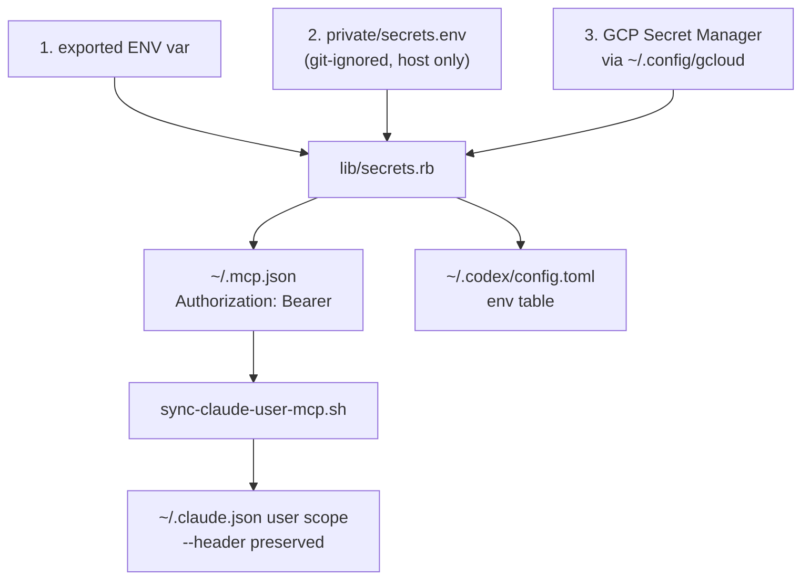
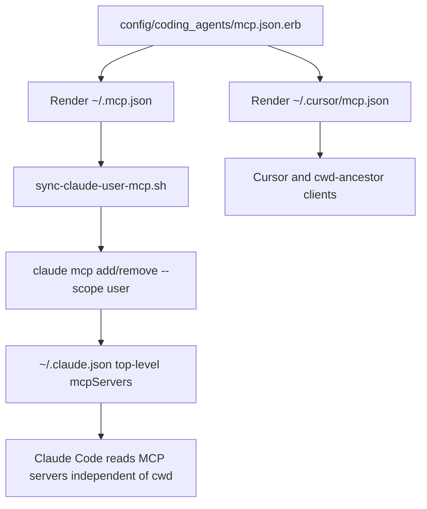
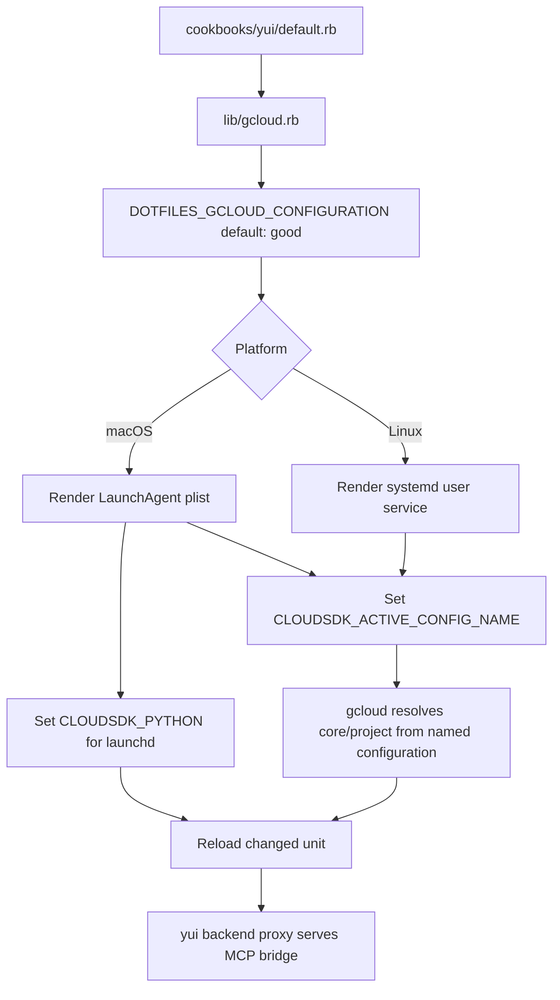

# dotfiles
> Accio, My Utensils!

## Usage
### Clone this repository
```shell
git clone --recursive https://github.com/Tyaba/dotfiles.git
```

## Prerequisites
```shell
sudo apt update
sudo apt install -y curl lsb-release
```
### wslの場合
windowsのPATHが入っているとinstall済と誤判定するので直す
sudo emacs /etc/wsl.conf
```
# WindowsのPATHを引き継がない設定を追記する
[interop]
appendWindowsPath = false
```

### Dry-run
```shell
./install.sh -n
```

### Apply
```shell
./install.sh
```

### Add new cookbook
```shell
mkdir cookbooks/:app_name
$EDITOR cookbooks/:app_name/default.rb
$EDITOR roles/$(uname)/default.rb
```

### Dev Container (lightweight role)

`roles/devcontainer/` is a lightweight role intended for Dev Containers (e.g. the `@devcontainers/cli` workflow in [tyaba-env](https://github.com/Tyaba/tyaba-env)). It assumes:

- devcontainer features already installed `git` / `gh` / `gcloud` / `mise` / `claude`
- project `.mise.toml` installs language runtimes (`python` / `uv` / `node` / `pnpm`)

It deploys only user-level dotfiles (`.claude/`, `.codex/`, `.cursor/`, `.mcp.json`, `.gitconfig`, zsh config) and the Codex CLI (needed by the `codex` MCP server in `~/.mcp.json`). Heavy cookbooks (emacs / docker / ghostty / redis / brew / GUI apps) and macOS-only setup are skipped.

Run without sudo:

```shell
DOTFILES_ROLE=devcontainer ./install.sh
```

`install.sh` detects the env var and runs mitamae as the workspace user (no `sudo -E`), since this role only touches `$HOME`. `lib/recipe.rb` then routes to `roles/devcontainer/default.rb` instead of the platform default.

### mise managed tools

`cookbooks/mise/default.rb` installs mise via the official curl installer, deploys `config/mise/config.toml.erb` to `~/.config/mise/config.toml`, and runs `mise install` from that config. The mise config trusts the normal project roots (`~/ghq`, `/workspaces`) so MCP servers launched through mise shims keep working from git worktrees.


```mermaid
flowchart TD
    A[install mise via curl] --> B[Add mise shims to PATH]
    B --> C[Install Python build packages on Ubuntu/Debian]
    C --> D[Install tflint]
    D --> E[Install kubectl and pnpm mise plugins]
    E --> F[Deploy ~/.config/mise/config.toml from template]
    F --> G[Run mise install for configured tools]
```

## Coding Agents

### Configuration Structure

```
config/
└── coding_agents/
    ├── claude/             # Claude Code-specific (settings.json, CLAUDE.md, etc.)
    ├── codex/              # Codex CLI-specific (AGENTS.md)
    ├── cursor/             # Cursor-specific (rules/, hooks.json)
    ├── hooks/              # Shared hooks
    ├── skills/             # Shared skills
    ├── private/            # Git-ignored secrets (secrets.env, denied_mcp_servers.json)
    ├── mcp.json.erb        # MCP server definitions (ERB template)
    ├── sync-claude-user-mcp.sh
    └── user-rules.md       # Shared user rules (Claude Code / Cursor)
```

### Secrets

API keys are never committed. `lib/secrets.rb` resolves them into `ENV` before
`roles/base/default.rb` renders the agent templates, so `mcp.json.erb` and
`codex/config.toml.erb` can embed the values. Resolution order per key, first
hit wins:

| Tier | Source | Available where |
|---|---|---|
| 1 | An already-exported environment variable | everywhere (escape hatch, CI override) |
| 2 | `config/coding_agents/private/secrets.env` | host only, git-ignored, offline |
| 3 | GCP Secret Manager | host and devcontainer |

Tier 3 is the source of truth and needs no per-machine setup — a fresh Mac or a
rebuilt devcontainer picks up the keys from `./install.sh` alone. Add a key with:

```shell
gcloud_configuration="${DOTFILES_GCLOUD_CONFIGURATION:-good}"
gcloud_project="${DOTFILES_GCP_PROJECT:-$(CLOUDSDK_ACTIVE_CONFIG_NAME="$gcloud_configuration" \
  gcloud config configurations describe "$gcloud_configuration" \
    --format='value(properties.core.project)')}"
read -rs CONTEXT7_API_KEY   # paste, then Enter (nothing is echoed)
printf '%s' "$CONTEXT7_API_KEY" | CLOUDSDK_ACTIVE_CONFIG_NAME="$gcloud_configuration" \
  gcloud secrets create context7-api-key \
    --project="$gcloud_project" \
    --replication-policy=automatic --data-file=-
```

Use `printf`, not `echo`: a trailing newline in the secret would corrupt the
`Authorization` header. Rotate with `gcloud secrets versions add` instead of
`create`. Register the `ENV var -> secret name` mapping in the `gcp_secrets`
hash at the top of `lib/secrets.rb`.

The GCP project id is read from a named gcloud configuration rather than
hardcoded, because this repository is public. The configuration defaults to
`good`, can be overridden with `DOTFILES_GCLOUD_CONFIGURATION`, and is passed via
`CLOUDSDK_ACTIVE_CONFIG_NAME` so both the project and authentication account are
pinned regardless of the active configuration. `DOTFILES_GCP_PROJECT` overrides
the project id directly. `~/.config/gcloud` is bind-mounted into devcontainers,
so the same pinned lookup resolves there.

Tier 2 stays useful for keys that do not belong in Secret Manager, or to work
offline. One `KEY=value` per line (`export ` prefixes and quotes are tolerated):

```shell
mkdir -p config/coding_agents/private
echo 'CONTEXT7_API_KEY=ctx7sk-...' >> config/coding_agents/private/secrets.env
```

Nothing here is fatal. When every tier misses, `lib/secrets.rb` logs a `WARN`
and the templates omit the credential — the MCP server falls back to
unauthenticated, rate-limited access. Watch for that warning after a
`gcloud auth login` expires, since the render will quietly replace a working
`~/.mcp.json` with a credential-less one.


```mermaid
flowchart TD
    A["1. exported ENV var"] --> D[lib/secrets.rb]
    B["2. private/secrets.env<br/>(git-ignored, host only)"] --> D
    C["3. GCP Secret Manager<br/>via ~/.config/gcloud"] --> D
    D --> E["~/.mcp.json<br/>Authorization: Bearer"]
    D --> F["~/.codex/config.toml<br/>env table"]
    E --> G[sync-claude-user-mcp.sh]
    G --> H["~/.claude.json user scope<br/>--header preserved"]
```

### Deployment

`roles/base/default.rb` deploys configurations via symlinks:

| Source | Target |
|---|---|
| `config/coding_agents/claude/settings.json` | `~/.claude/settings.json` |
| `config/coding_agents/skills/` | `~/.claude/skills/`, `~/.cursor/skills/` |
| `config/coding_agents/mcp.json.erb` | `~/.mcp.json`, `~/.cursor/mcp.json` |
| `config/coding_agents/codex/AGENTS.md` | `~/.codex/AGENTS.md` |

After rendering `~/.mcp.json`, `roles/base/default.rb` runs
`config/coding_agents/sync-claude-user-mcp.sh`. The script reads the rendered MCP
definitions and registers them with `claude mcp add --scope user`, then prunes
user-scoped servers removed from the template. Claude Code also sees the synced
servers in devcontainers where `/workspaces/<name>` is outside `$HOME`. The Git
MCP server is intentionally omitted because regular shell `git` covers the use case.


```mermaid
flowchart TD
    A[config/coding_agents/mcp.json.erb] --> B[Render ~/.mcp.json]
    A --> C[Render ~/.cursor/mcp.json]
    B --> D[sync-claude-user-mcp.sh]
    D --> E[claude mcp add/remove --scope user]
    E --> F[~/.claude.json top-level mcpServers]
    F --> G[Claude Code reads MCP servers independent of cwd]
    C --> H[Cursor and cwd-ancestor clients]
```

### Yui MCP proxy

`cookbooks/yui/default.rb` deploys the Cloud Run proxy as a macOS LaunchAgent or
Linux systemd user service. The unit definitions do not hardcode a GCP project ID;
they set `CLOUDSDK_ACTIVE_CONFIG_NAME` so gcloud resolves the project from that
named configuration instead of the mutable active configuration. Override the
configuration with `DOTFILES_GCLOUD_CONFIGURATION`; the default is `good`.

The macOS plist still sets `CLOUDSDK_PYTHON` explicitly because launchd does not
inherit zsh exports from `config/.zsh/lib/apps`. Unit updates trigger an immediate
reload so the running job uses the latest definition.


```mermaid
flowchart TD
    A[cookbooks/yui/default.rb] --> B[lib/gcloud.rb]
    B --> C[DOTFILES_GCLOUD_CONFIGURATION default: good]
    C --> D{Platform}
    D -->|macOS| E[Render LaunchAgent plist]
    D -->|Linux| F[Render systemd user service]
    E --> G[Set CLOUDSDK_ACTIVE_CONFIG_NAME]
    F --> G
    E --> H[Set CLOUDSDK_PYTHON for launchd]
    G --> I[gcloud resolves core/project from named configuration]
    H --> J[Reload changed unit]
    I --> J
    J --> K[yui backend proxy serves MCP bridge]
```

### Codex Offload (via MCP server)

Claude Code tasks are automatically offloaded to Codex via the `codex mcp-server` MCP integration. Claude calls `mcp__codex__codex` as a regular tool, enabling natural auto-delegation. Delegation criteria are defined in `config/coding_agents/user-rules.md`.

**Setup (after `./install.sh`):**
```shell
codex login          # Authenticate with ChatGPT Enterprise (one-time)
```

**Key features:**
- `base-instructions` parameter allows dynamic injection of project-specific rules into Codex
- `codex-reply` enables multi-turn Codex sessions via `threadId`
- `~/.codex/AGENTS.md` provides static global rules for direct Codex CLI usage

**Constraints:**
- Requires local OAuth authentication (browser flow) -- not available in CI/headless environments
