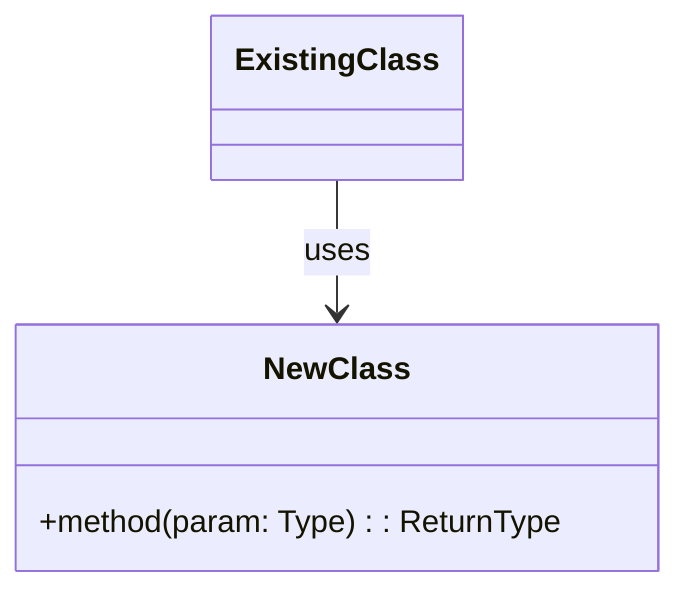
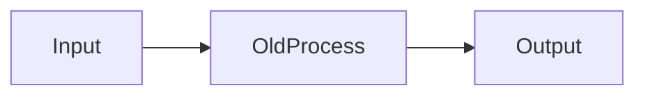
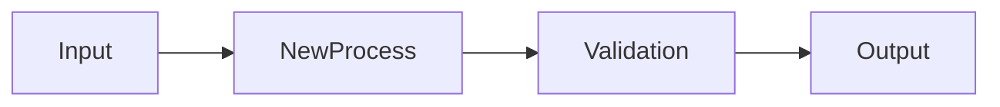

## 関連 Issue

Part of #<Epic Issue番号>
Closes #<Issue番号>

## 概要

<このPRの目的を1-2文で説明。レビューをして欲しい観点も記載。紐づく PR や資料があればリンクを貼る。>

## 背景・目的

<なぜこの変更が必要か？どのような問題を解決するか？>

## 変更内容

- <主な変更点をリスト形式で>
-
-

## AI監査

### Assumptions（仮定事項）

AIが明示的な指示なしに仮定した事項。コンテクストの欠損を検出するためのリスト。

- <仮定した内容>（<根拠: 明示的指示なし / 既存コードから推測 / 一般的慣習 等>）

### Intent Mapping（意図と実装の対応）

| ユーザーの意図 | AIの解釈 | 実装方法 | 未考慮事項 |
|---|---|---|---|
| <意図> | <どう解釈したか> | <どう実装したか> | <考慮しなかった点> |

### Confidence（確信度）

| 対象 | 確信度 | 理由 |
|---|---|---|
| <ファイルや機能> | 高 / 中 / 低 / 要確認 | <なぜその確信度か> |

### Behavior（振る舞い契約）

このPRが追加・変更する振る舞いを Given-When-Then 形式で宣言する。

- **Given** <前提条件> **When** <操作> **Then** <期待結果>

### Flow Diagram（処理フロー図）

複雑な処理や外部通信を伴うフロー変更・追加がある場合、mermaid で処理フローを図示する。

```mermaid
sequenceDiagram
    participant <Actor/System>
    participant <Actor/System>
    <Actor/System>->>+<Actor/System>: <リクエスト>
    <Actor/System>-->>-<Actor/System>: <レスポンス>
```

> フローの種類に応じて `sequenceDiagram`、`flowchart`、`stateDiagram-v2` 等を使い分ける。

### Code Changes（コード構造変更）

Diff を読まなくても変更の全体像を把握できるよう、ファイル単位でコード構造の変更を可視化する。

#### `path/to/new_file.py`

<1-2文でこのファイルの変更概要>



**入出力例:**
- Input: `method(param=ExampleValue)`
- Output: `ReturnType(field=Result)`

#### `path/to/modified_file.py`

<1-2文でこのファイルの変更概要>

**Before:**



**After:**



**変更点:** <何がどう変わったかを簡潔に>

**入出力例:**
- Input: `func(x=10)`
- Output: `Result(validated=True, value=10)`

## 技術的変更点概要

<プルリクエストで実際に変更したものをコンテキストごとに記載。変更で補足が必要なものがある場合も記載。>

## 影響範囲

- <この変更が影響する範囲（ファイル、機能、他のコンポーネント等）>

## テスト

### テスト項目

- [ ] 既存テストが通過
- [ ] 新規テストを追加
- [ ] 手動テストを実施

### テスト結果

```bash
# テスト実行コマンドと結果を記載
```

## チェックリスト

- [ ] Assignees に自分を追加した
- [ ] コードが期待通りに動作する
- [ ] テストが通過する
- [ ] 既存機能に影響がないことを確認
- [ ] コードレビューの準備ができている
- [ ] 必要に応じてドキュメントを更新

## 補足・注意事項

<レビュアーに伝えたいこと、注意点、今後の課題など>
